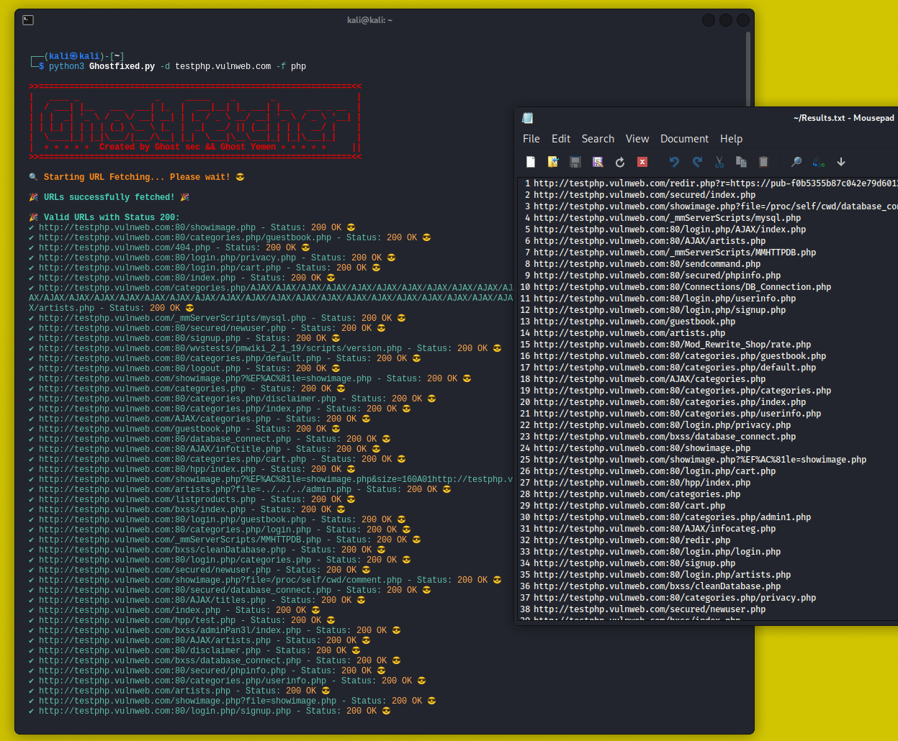

# URL Fetcher App

URL Fetcher App is a tool that fetches a list of URLs from various sources, including OTX, Wayback Machine, Common Crawl, and URLScan. This tool is useful for gathering domain-related information and filtering valid URLs with a 200 OK status.

## Main Features
- Fetch URLs from multiple sources.
- Filter valid URLs with HTTP status 200 OK.
- Filter URLs by specific file types (e.g., `.js`, `.pdf`, etc.).
- Save the fetched URLs to a file.
- Clean and user-friendly interface.

## Installation Instructions

### Requirements
- Python 3.x
- Required Python libraries:
  - `requests`
  - `colorama`
  - `python-dotenv`

### Installation Steps:
1. Clone this repository:
   ```bash
   git clone https://github.com/username/URLFetcherApp.git
   cd URLFetcherApp
   ```

2. Install dependencies:
   ```bash
   pip install -r requirements.txt
   ```

3. Create a `.env` file in the root of the project and add your `URLSCAN_API_KEY`:
   ```
   URLSCAN_API_KEY=your_api_key_here
   ```

4. Run the app:
   ```bash
   python app.py -d yourdomain.com
   ```

### Usage Options:
- `-d` / `--domain`: The domain from which to fetch URLs (e.g., `example.com`).
- `-o` / `--output`: Output file to save the fetched URLs.
- `-f` / `--filetype`: Filter URLs by file extension (e.g., `js`, `pdf`).

Example:
```bash
python Ghost_fetch.py -d example.com -o urls.txt -f js
```
<p align="center">

</p>

## Example Output
```bash
>>==============================================================<<
|   ____ _               _     _____    _       _                |
|  / ___| |__   ___  ___| |_  |  ___|__| |_ ___| |__   ___ _ __  |
| | |  _| '_ \ / _ \/ __| __| | |_ / _ \ __/ __| '_ \ / _ \ '__| |
| | |_| | | | | (_) \__ \ |_  |  _|  __/ || (__| | | |  __/ |    |
|  \____|_| |_|\___/|___/\__| |_|  \___|\__\___|_| |_|\___|_|    |
|  ⭐⭐⭐⭐⭐ Created by Ghost sec && Ghost Yemen ⭐⭐⭐⭐⭐    ||
>>==============================================================<<

🔍 Starting URL Fetching... Please wait! 😎

🎉 URLs successfully fetched! 🎉

🎉 Valid URLs with Status 200:
✔️ http://example.com/index.php - Status: 200 OK 😎
✔️ http://example.com/about-us.php - Status: 200 OK 😎
✔️ http://example.com/contact.php - Status: 200 OK 😎
```

## Contributing

If you are interested in contributing to this project, you can open a **Pull Request** or raise an **Issue** for bugs or feature requests.

## License

This project is licensed under the MIT License - see the [LICENSE](LICENSE) file for details.
